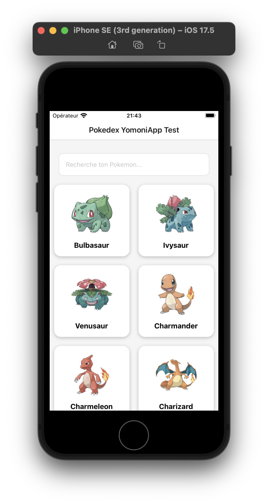
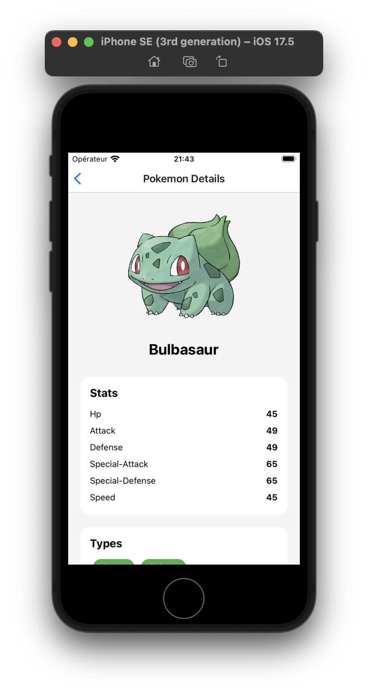
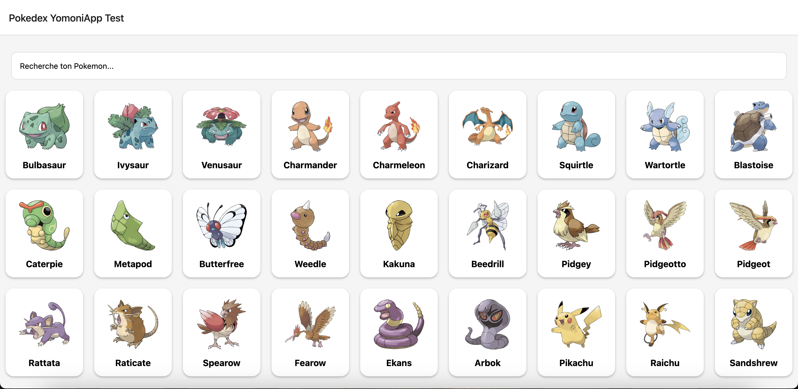
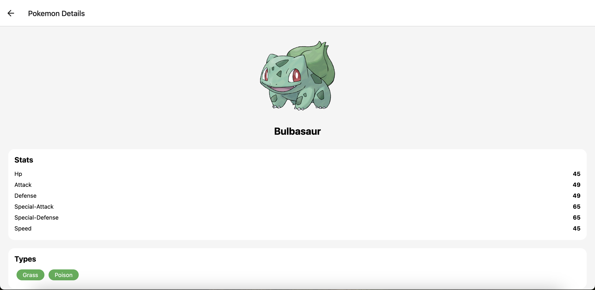

# 🎮 PokéSearch App

<div align="center">
  

  Une application moderne et responsive pour explorer l'univers Pokémon, développée avec Expo et React Native.

  [](https://expo.dev/)
  []()
  []()
  []()
</div>

## 📱 Aperçu

### Version Mobile
<div style="display: flex; gap: 20px;">
  
  
</div>

### Version Web
<div style="display: flex; gap: 20px;">
  
  
</div>

## 🚀 À propos du projet

cette application cross-platform  permet aux utilisateurs d'explorer l'univers Pokémon. Développée avec Expo et React Native, elle offre une expérience utilisateur fluide et responsive sur iOS, Android et Web.

### Fonctionnalités principales

- 🔍 Recherche de Pokémon
- 📱 Interface responsive adaptée à tous les écrans
- 📊 Affichage détaillé des statistiques
- ⚡ Performance optimisée

## 🏗 Architecture

### Atomic Design
L'application suit les principes de l'Atomic Design pour une architecture modulaire et maintenable :

```
src/
├── components/
│   ├── atoms/         # Composants de base (Input, PokemonImage)
│   ├── molecules/     # Combinaisons d'atoms (PokemonCard)
│   └── organisms/     # Structures complexes (PokemonList)
├── screens/           # Écrans de l'application
└── api/              # Logique d'API
```

### Gestion des données

- **TanStack Query** pour une gestion efficace des requêtes API
- Cache optimisé pour une meilleure performance
- Gestion d'état centralisée

## 🛠 Technologies utilisées

- **Framework**: Expo / React Native
- **État & Cache**: TanStack Query
- **Navigation**: React Navigation
- **API**: PokeAPI
- **Type safety**: TypeScript

## 🔜 Améliorations futures

- [ ] Pagination des résultats (actuellement limité à 100 Pokémon)
- [ ] Filtres avancés (type, génération, etc.)
- [ ] Mode hors ligne avec AsyncStorage
- [ ] Animations d'interface utilisateur
- [ ] Thème sombre/clair
- [ ] Favoris personnalisés
- [ ] Comparaison de Pokémon
- [ ] Statistiques avancées et graphiques
- [ ] Tests unitaires et d'intégration
- [ ] Localisation (multi-langue)

## 🚀 Installation

1. Cloner le repository
```bash
git https://github.com/JeremyNoh/YomoniAppTest
```

2. Installer les dépendances
```bash
cd YomoniAppTest
npm install
```

3. Lancer l'application
```bash
npm start
```

## 📱 Plateformes supportées

- ✅ iOS
- ✅ Android
- ✅ Web


## 📝 Licence

Ce projet est sous licence MIT.